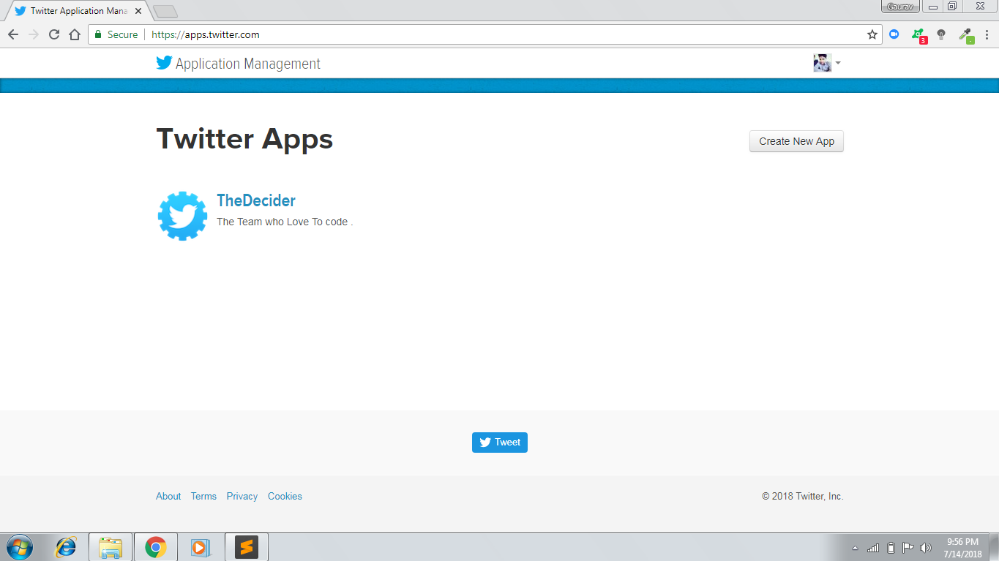

#                               Build A Tweet Bot With Python
--------------------------------------------------------------------------------------------------------
## What is TwitterBot?
### Twitter bot is a terminal application in Python which uses Twitter API and perform the following tasks
1. Retrieve Tweets
2. Count the followers
3. Determine the sentiment
4. Determine location,language and time zone.
5. Compare tweets 
6. Analyze top usage 
7. Tweet a message 

------------------------------------------------------------------------------------------------------

## Why TwitterBot?
### This project has great significance in terms of sentiment analysis and comparison of tweets.
### In addition to that we can also retrieve the location , language and timezone for the same.

------------------------------------------------------------------------------------------------------
## Components of twitterbot
### 1. Twitter bot requires following things
### 2. API access token of twitter
### 3. Client Id and secret
### 4. Nltk, paralleldots library,tweepy
### 5. Counters
### 6. Python requests

-----------------------------------------------------------------------------------------------------

##  Create A Twitter Account
----------------------------------------------------------------------------------------------------

### The first step is creating a Twitter account https://twitter.com/signup. Once this is done the next step is to create a new application.

----------------------------------------------------------------------------------------------------

## Create a Twitter App
--------------------------------------------------------------------------------------------------
### Go to apps.twitter.com and click on 'Create New App ' button
### * Fill out the details of the form correctly
### * Read the developer agreement section, and check the box at the bottom if you agree. Then click on the ‘Create your Twitter application’ button

